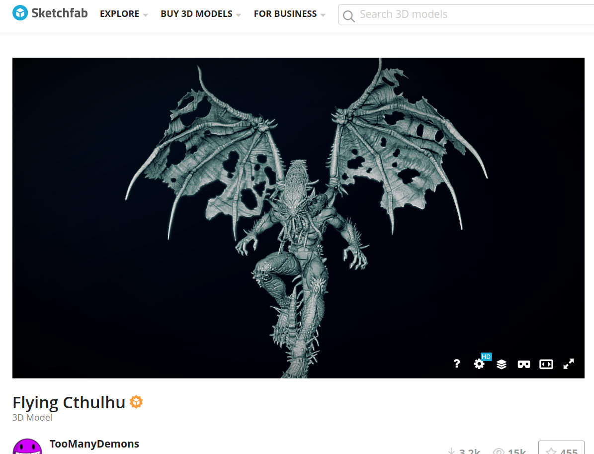
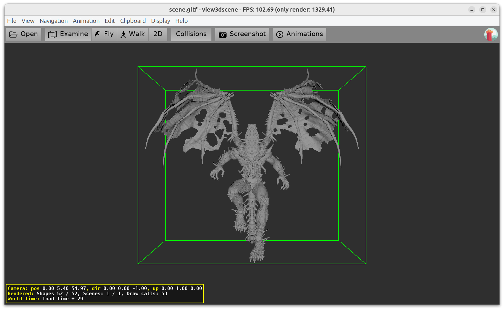

# Using Sketchfab API to search and download glTF (for Castle Game Engine)

Use Sketchfab API to perform:

- search in Sketchfab for given query string (`cthulhu` by default)
- download a glTF file
- For extra effect, at the end it opens resulting glTF with view3dscene.

Purpose: Sketchfab integration with [Castle Game Engine](https://castle-engine.io/) editor.

The code defines a nice reusable `TSketchfabModel` class, that holds various information about the model:

- model ID (used to later download the model)
- name
- description
- face count
- license
- thumbnail URL (Sketchfab provides thumbnails of various sizes, we choose the one closest to 256x256)

All in clear modern Object Pascal.

The code uses some _Castle Game Engine_ API (like `CastleLog`, `CastleDownload`). In principle, if needed, you could likely make it independent of CGE (e.g. use `TFPHTTPClient` from FPC for all HTTP communication, instead of CGE `TCastleDownload`).

## Screenshots




## Usage

* Get your Sketchfab token from https://sketchfab.com/settings/password , paste it into `sketchfab_token.inc` file here (this file is ignored by `.gitignore`)

* Build and run the application:

    ```
    castle-engine compile --mode=debug
    ./sketchfab_download
    ```

    Response should be like this:

    ```
    Log for "sketchfab_download".
    ....
    Got response, storing in response-search.json (for debug)
    Found 24 models for query: cthulhu
    0 : Flying Cthulhu
      View on Sketchfab: https://sketchfab.com/3d-models/4737a3b84e00415b9d8bb42ae44285b2
      Description: Lovingly Crafted in Zbrush 2018 for the folks at Sketchfab.
      Face Count: 4714341
      License: CC Attribution
      Best (closest to 256) thumbnail: https://media.sketchfab.com/models/4737a3b84e00415b9d8bb42ae44285b2/thumbnails/756332595052485ea2c672595bf4516b/30abfdde48bc4b008358c75d49d84fe8.jpeg

    1 : Cthulhu
      View on Sketchfab: https://sketchfab.com/3d-models/6d05f0957cfc4a3bba2aaa01d58acbd9
      .....

    Starting download of model id : 4737a3b84e00415b9d8bb42ae44285b2
    Got response, storing in response-download.json (for debug)
    Downloading model from: https://sketchfab-prod-media.s3.amazonaws.com/.....
    Download size: 82.61 MB
    Network: Downloading "https://sketchfab-prod-media.s3.amazonaws.com/archives/...."
    Network: Successfully downloaded "https://sketchfab-prod-media.s3.amazonaws.com/archives/....", MIME type "application/zip", HTTP response code 200
    Model downloaded to: model.zip, file size: 82.61 MB
    Model extracted to: model/4737a3b84e00415b9d8bb42ae44285b2
    ```

* Pass a command-line parameter to change the query. It is `cthulhu` by default. Use anything else, this is just a query string for Sketchfab, you can look for anything on Sketchfab. E.g. run

    ```
    ./sketchfab_download castle
    ```

* By default is downloads the first search hit, but you can easily customize it.

    * Click on the list of URLs in console to easily inspect the models.

    * If you want to download a particular model, then comment out

        ```
        Model := TSketchfabModel.SearchGetFirst(Query);
        ```

        in code with a simple hardcoded value for your model, e.g.

        ```
        Model := TSketchfabModel.Create;
        Model.ModelId := '42002fa6abcc41e18abeb3da9edca096';
        ```

## Licensing of downloaded models

See https://sketchfab.com/developers/download-api , https://sketchfab.com/developers/download-api/guidelines :

> Models licensing
>
> More than 700,000 3D models are available for download under Creative Commons licenses. Most models allow commercial use. However, Creative Commons licenses require that anyone who uses the model must credit the author and the source (Sketchfab). Your app should clearly display the license of the model as well as author attribution. Typically, this includes the creator’s username and a link to the Sketchfab model.

## Licensing of this code

Permissive "modified BSD 3-Clause", see https://github.com/castle-engine/castle-engine/blob/master/doc/licenses/COPYING.BSD-3-clause.txt .

## Authors

Michalis Kamburelis and GitHub Copilot. Or the other way around.
